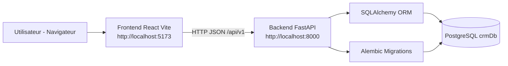
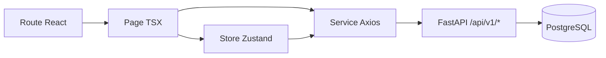
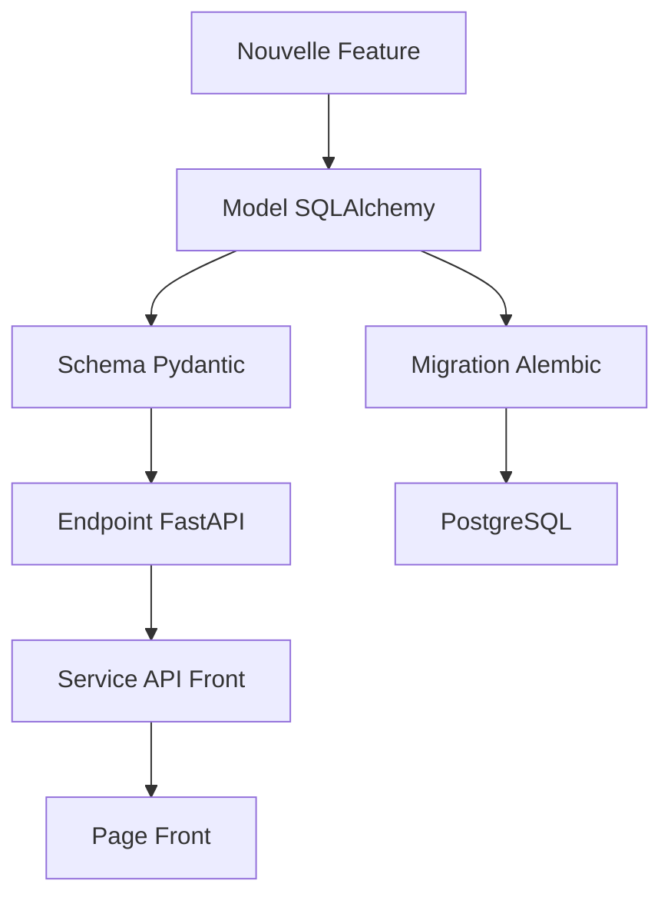

# Guide D'Onboarding Interne CRM (Frontend + Backend)

## 1) Objectif Du Guide
Ce document sert de guide unique pour onboarder un stagiaire debutant sur ce projet CRM.

Objectifs pratiques:
- Comprendre l'architecture globale frontend/backend.
- Savoir ou intervenir selon un besoin metier.
- Lancer le projet localement et diagnostiquer rapidement les erreurs.
- Suivre les conventions du repo pour contribuer sans casser l'existant.

Perimetre:
- Documentation technique uniquement.
- Etat reel du code au moment de redaction.

---

## 2) Carte Rapide Du Repo
Arborescence utile (hors `venv`, `node_modules`, caches):

```text
crm-professional/
+- backend/
�  +- app/
�  �  +- api/v1/
�  �  �  +- api.py
�  �  �  +- endpoints/*.py
�  �  +- core/config.py
�  �  +- db/{base.py, base_class.py, session.py}
�  �  +- models/*.py
�  �  +- schemas/*.py
�  +- alembic/
�  �  +- env.py
�  �  +- versions/*.py
�  +- scripts/bootstrap_db.py
�  +- alembic.ini
�  +- requirements.txt
�  +- .env.example
+- frontend/
�  +- src/
�  �  +- app/App.tsx
�  �  +- main.tsx
�  �  +- pages/*.tsx
�  �  +- services/api.ts
�  �  +- store/*.ts
�  �  +- routes/ProtectedRoute.tsx
�  �  +- layouts/*.tsx
�  �  +- components/*
�  �  +- app/components/ui/*
�  �  +- data/mockData.ts
�  �  +- styles/*
�  +- package.json
�  +- .env.example
+- docs/
�  +- ONBOARDING_INTERNE.md
+- .gitignore
+- README.md
```

Classification des zones:
- Core backend: `backend/app`, `backend/alembic`, `backend/alembic.ini`.
- Core frontend: `frontend/src/app`, `frontend/src/services`, `frontend/src/store`, `frontend/src/pages`.
- Infrastructure: `backend/scripts/bootstrap_db.py`, env files, configs build.
- Legacy/auxiliaire: `frontend/src/data/mockData.ts`, nombreux composants UI generiques non utilises partout.

---

## 3) Architecture Globale
Le systeme est separe en 2 sous-systemes:
- Frontend SPA React/Vite qui gere UI + navigation + appel API.
- Backend FastAPI qui expose `/api/v1/*` et persiste via SQLAlchemy/PostgreSQL.



### Stack technique effective
Backend:
- FastAPI
- SQLAlchemy 2.0
- Alembic
- psycopg2
- Pydantic v2 + pydantic-settings

Frontend:
- React + TypeScript
- Vite
- Zustand (state local/persist)
- Axios
- React Router
- React Query (present dans `App.tsx`, peu exploite dans les pages actuelles)

---

## 4) Backend: Dossier Par Dossier, Fichier Par Fichier (Core)

### 4.1 `backend/app/main.py` (point d'entree API)
Role:
- Cree l'app FastAPI.
- Configure CORS depuis `settings.cors_origins`.
- Enregistre tous les tags OpenAPI.
- Monte le routeur v1 (`/api/v1`).
- Hook startup: tente `Base.metadata.create_all()`, puis fallback de dev `drop_all + create_all` en cas d'erreur SQLAlchemy.

Attention stagiaire:
- Ce fallback startup est pratique en dev mais dangereux si environment sensible.
- La vraie source d'evolution schema reste Alembic.

### 4.2 `backend/app/core/config.py` (configuration centralisee)
Role:
- Charge `.env` (UTF-8).
- Expose les variables applicatives (`APP_NAME`, `API_V1_PREFIX`, `CORS_ORIGINS`).
- Construit `DATABASE_URL` Postgres.

Variables DB attendues:
- `POSTGRES_USER`
- `POSTGRES_PASSWORD`
- `POSTGRES_HOST`
- `POSTGRES_PORT`
- `POSTGRES_DB` (par defaut `crmDb`)

### 4.3 Couche DB `backend/app/db/*`
- `base_class.py`: classe `Base` (DeclarativeBase SQLAlchemy).
- `session.py`: `engine`, `SessionLocal`, dependance `get_db()` injectee dans endpoints.
- `base.py`: importe tous les models pour remplir `Base.metadata`.

Regle importante:
- Si un nouveau model n'est pas importe dans `base.py`, Alembic/autoload peuvent l'ignorer.

### 4.4 Couche API v1 `backend/app/api/v1/*`
- `api.py`: composeur principal qui include tous les routers.
- `endpoints/*.py`: un fichier par module metier.

Modules exposes:
- `health`
- `auth`
- `clients`
- `projets`
- `ressources`
- `utilisateurs`
- `services`
- `acces`
- `rappels`
- `ai-monitoring`
- `devis`
- `factures`
- `contrats`
- `cahier-de-charge`

Pattern endpoint standard:
- `GET /module`
- `GET /module/{id}`
- `POST /module`
- `PUT /module/{id}`
- `DELETE /module/{id}`

Specificites importantes:
- `POST /api/v1/utilisateurs/seed/admin`: cree/met a jour un admin demo.
- `auth.py`: auth simplifiee par token en memoire (`_TOKENS`) et mot de passe en clair (dev only).

### 4.5 Couche Models `backend/app/models/*`
Tables principales:
- `clients`
- `projets`
- `ressources`
- `utilisateurs`
- `services`
- `acces`
- `rappels`
- `ai_monitoring`
- `devis`
- `factures`
- `contrats`
- `cahier_de_charge`
- tables assoc many-to-many:
  - `projet_utilisateurs`
  - `devis_projets`
  - `facture_projets`

Model additionnel:
- `user.py` -> table `users` (heritage/legacy auth technique, distincte de `utilisateurs`).

Relations cles:
- Client 1-N Projets, Devis, Factures, Contrats, Rappels.
- Projet N-N Utilisateur via `projet_utilisateurs`.
- Devis N-N Projet via `devis_projets` + lien principal optionnel `devis.projetID`.
- Facture N-N Projet via `facture_projets` + lien optionnel vers Devis.
- Projet 1-1 CahierDeCharge.

### 4.6 Couche Schemas `backend/app/schemas/*`
Role:
- Contrats d'entree/sortie API (Pydantic).
- Typiquement 4 classes: `Base`, `Create`, `Update`, `Read`.

Flux standard:
1. Endpoint recoit `XxxCreate`/`XxxUpdate`.
2. Convertit en dict (`model_dump`).
3. Alimente model SQLAlchemy.
4. Retourne objet selon `XxxRead`.

### 4.7 Migration `backend/alembic/*`
- `alembic.ini`: config migration (URL DB initiale + logs).
- `alembic/env.py`: relie Alembic aux settings app; fallback prompt password interactif.
- `versions/20260212_0001_initial_schema.py`: premier schema.
- `versions/20260212_0002_full_crm_schema.py`: schema CRM actuel avec noms camelCase des colonnes.

Commande principale:
```bash
alembic upgrade head
```

### 4.8 Script infra `backend/scripts/bootstrap_db.py`
Role:
- Tente connexion postgres sur DB admin.
- Cree `POSTGRES_DB` si absente (ex: `crmDb`).
- Met a jour `backend/.env` avec credentials fonctionnels.
- En cas echec credentials, demande mot de passe interactif.

---

## 5) Frontend: Dossier Par Dossier, Fichier Par Fichier (Core)

### 5.1 Points d'entree
- `frontend/src/main.tsx`: bootstrap React, charge `App` et `styles/index.css`.
- `frontend/src/app/App.tsx`: coeur routing + provider React Query + gestion theme.

### 5.2 Routing et layouts
- `src/app/App.tsx`:
  - Routes publiques: `/login`, `/register`, `/forgot-password`.
  - Routes protegees (via `ProtectedRoute`): dashboard et modules CRM.
- `src/routes/ProtectedRoute.tsx`:
  - Si `isAuthenticated === false`, redirige vers `/login`.
- `src/layouts/AuthLayout.tsx`:
  - Cadre visuel pages auth.
- `src/layouts/DashboardLayout.tsx`:
  - Structure app authentifiee: `Sidebar` + `TopBar` + `<Outlet />`.

### 5.3 State management (`src/store/*`)
- `authStore.ts`:
  - Etat user + session via Zustand persist.
  - `login` et `register` appellent API backend reelle.
  - Stocke token dans `localStorage` (`auth-token`).
- `themeStore.ts`:
  - Theme light/dark persiste.
- `sidebarStore.ts`:
  - Etat collapse sidebar.

### 5.4 Couche API (`src/services/api.ts`)
Role:
- Instance Axios unique avec `baseURL`:
  - `import.meta.env.VITE_API_URL` ou fallback `http://localhost:8000/api/v1`.
- Interceptor request: injecte `Authorization: Bearer <token>`.
- Interceptor response: en 401, supprime token et redirige `/login`.

APIs exportees:
- `authAPI` (`/auth/login`, `/auth/register`, `/auth/me`)
- `clientsAPI`
- `projectsAPI` (note: backend attend `/projets`)
- `devisAPI`
- `facturesAPI`
- `contratsAPI`

### 5.5 Pages metier (`src/pages/*`)
Etat actuel important pour onboarding:
- `Login.tsx`, `Register.tsx`: branches sur API backend via `authStore`.
- Grande partie du reste (`Clients`, `Projects`, `Dashboard`, `Users`, etc.): alimentee par `src/data/mockData.ts`.

Conclusion pratique:
- Authentification: reelle.
- Plusieurs ecrans metier: encore en mode mock UI/demo.

### 5.6 Composants
- `src/components/*`: composants UI maison utilises par les pages.
- `src/app/components/ui/*`: grande librairie de composants style shadcn/radix (base reutilisable).
- `src/components/ui/*`: autre jeu de composants UI plus simple.

Point de vigilance:
- Il existe deux couches de composants UI (`components/ui` et `app/components/ui`).
- Eviter de melanger sans decision explicite de standardisation.

### 5.7 Styles
- `src/styles/index.css`: point d'entree CSS global.
- `src/styles/theme.css`, `fonts.css`, `tailwind.css`: theming/design tokens/utilitaires.

### 5.8 Config frontend
- `.env.example`: `VITE_API_URL=http://localhost:8000/api/v1`
- `vite.config.ts`: config bundler Vite.
- `vite-env.d.ts`: typings `import.meta.env` (corrige l'erreur TS connue).
- `package.json`: scripts `dev`, `build` + dependances React ecosystem.



---

## 6) Flux Metier Principaux (Frontend -> Backend -> DB)

### 6.1 Auth Login
- Front entry: `frontend/src/pages/Login.tsx`
- State: `frontend/src/store/authStore.ts` (`login()`)
- API call: `frontend/src/services/api.ts` -> `POST /auth/login`
- Endpoint: `backend/app/api/v1/endpoints/auth.py::login`
- Table cible: `utilisateurs`
- Stockage session: token en memoire backend (`_TOKENS`) + `localStorage` frontend.

### 6.2 Auth Register
- Front entry: `frontend/src/pages/Register.tsx`
- API call: `POST /auth/register`
- Endpoint: `auth.py::register`
- Table impactee: `utilisateurs`

### 6.3 Seed admin demo
- Endpoint direct: `POST /api/v1/utilisateurs/seed/admin`
- Backend file: `backend/app/api/v1/endpoints/utilisateurs.py`
- Table impactee: `utilisateurs`
- Payload applique:
```json
{
  "nom": "Anfel Ajimi",
  "email": "admin@gmail.com",
  "role": "developpeur",
  "actif": true,
  "motDePasse": "admin123"
}
```

### 6.4 CRUD Clients
- API service prevu: `clientsAPI` dans `frontend/src/services/api.ts`
- Endpoint backend: `backend/app/api/v1/endpoints/clients.py`
- Table: `clients`
- Ecran actuel: `frontend/src/pages/Clients.tsx` est encore mock.

### 6.5 CRUD Projets
- API service prevu: `projectsAPI` (`/projets`)
- Endpoint backend: `backend/app/api/v1/endpoints/projets.py`
- Table: `projets`
- Ecran actuel: `frontend/src/pages/Projects.tsx` est mock.

### 6.6 CRUD Devis
- API service prevu: `devisAPI`
- Endpoint: `backend/app/api/v1/endpoints/devis.py`
- Tables: `devis`, `devis_projets`
- Particularite: `projetIDs` gere relation N-N.

### 6.7 CRUD Factures
- API service prevu: `facturesAPI`
- Endpoint: `backend/app/api/v1/endpoints/factures.py`
- Tables: `factures`, `facture_projets`
- Particularite: lien optionnel `devisID` + relation N-N projets.

### 6.8 CRUD Contrats
- API service prevu: `contratsAPI`
- Endpoint: `backend/app/api/v1/endpoints/contrats.py`
- Table: `contrats`

### 6.9 Autres modules backend exposes
- `ressources` -> table `ressources`
- `services` -> table `services`
- `acces` -> table `acces`
- `rappels` -> table `rappels`
- `ai-monitoring` -> table `ai_monitoring`
- `cahier-de-charge` -> table `cahier_de_charge`

### Tableau de tra�abilite rapide

| Module | Page Front principale | Service API Front | Endpoint Backend | Table(s) DB |
|---|---|---|---|---|
| Auth | `Login.tsx`, `Register.tsx` | `authAPI` | `/auth/*` | `utilisateurs` |
| Clients | `Clients.tsx` (mock actuellement) | `clientsAPI` | `/clients/*` | `clients` |
| Projets | `Projects.tsx` (mock) | `projectsAPI` | `/projets/*` | `projets` |
| Devis | `Devis.tsx` (mock) | `devisAPI` | `/devis/*` | `devis`, `devis_projets` |
| Factures | `Factures.tsx` (mock) | `facturesAPI` | `/factures/*` | `factures`, `facture_projets` |
| Contrats | `Contrats.tsx` (mock) | `contratsAPI` | `/contrats/*` | `contrats` |
| Utilisateurs | `Users.tsx` (mock) | (a brancher) | `/utilisateurs/*` | `utilisateurs` |

---

## 7) Runbook Local (Setup / Run / Debug)

### 7.1 Prerequis
- Python 3.11+
- PostgreSQL local (service actif)
- Node.js 18+

### 7.2 Setup backend
Depuis `backend/`:

```bash
python -m venv venv
venv\Scripts\activate
pip install -r requirements.txt
```

Creer/valider DB et `.env`:
```bash
python scripts\bootstrap_db.py
```

Appliquer migrations:
```bash
alembic upgrade head
```

Lancer API:
```bash
uvicorn app.main:app --reload
```

URLs utiles:
- API root: `http://127.0.0.1:8000/`
- Swagger: `http://127.0.0.1:8000/docs`
- OpenAPI JSON: `http://127.0.0.1:8000/openapi.json`

### 7.3 Setup frontend
Depuis `frontend/`:

```bash
npm install
copy .env.example .env
npm run dev
```

Verifier `frontend/.env`:
```env
VITE_API_URL=http://localhost:8000/api/v1
```

### 7.4 Routine quotidienne
1. Darrer PostgreSQL.
2. Darrer backend (`uvicorn ...`).
3. Darrer frontend (`npm run dev`).
4. Ouvrir `/docs` pour tester endpoints critiques.
5. Verifier console navigateur + logs backend a chaque changement API.

### 7.5 Checklist avant commit
- Si model DB modifie -> migration Alembic ajoutee.
- Si endpoint change -> `services/api.ts` aligne.
- Si route frontend change -> `App.tsx` + `Sidebar.tsx` alignes.
- Test manuel minimal: login + 1 CRUD touche.
- Aucun secret dans git (`.env` ignore).

---

## 8) Erreurs Courantes Et Solutions

### 8.1 `relation "utilisateurs" n'existe pas`
Cause probable:
- Migrations non appliquees sur la bonne DB.

Diagnostic:
```bash
alembic current
alembic history
```

Resolution:
1. Verifier `backend/.env` (`POSTGRES_DB=crmDb`).
2. `alembic upgrade head`.
3. Redemarrer l'API.

### 8.2 `UndefinedColumn ... factureID`
Cause probable:
- Schema cree par `create_all` non synchronise avec migrations precedentes.

Resolution:
1. Verifier ordre des migrations en `backend/alembic/versions`.
2. Re-appliquer schema cible via Alembic.
3. Eviter dependre uniquement de `create_all` pour evolutions schema.

### 8.3 `UnicodeDecodeError ... psycopg2 ... utf-8`
Cause probable:
- Caractere non UTF-8 dans credentials/DSN/env.

Resolution:
1. Re-saisir le mot de passe dans `.env` en ASCII simple.
2. Regenerer `.env` via `python scripts\bootstrap_db.py`.
3. Rejouer `alembic upgrade head`.

### 8.4 `RuntimeError: Database authentication failed`
Cause probable:
- `POSTGRES_USER`/`POSTGRES_PASSWORD` invalides dans `backend/.env`.

Resolution:
1. Corriger `.env`.
2. Relancer `bootstrap_db.py` si besoin.
3. Retester migration.

### 8.5 Mismatch endpoint frontend/backend (`/projects` vs `/projets`)
Cause probable:
- Route UI anglaise mais endpoint API francise.

Resolution:
- Toujours verifier mapping dans `frontend/src/services/api.ts`.

### 8.6 CORS bloque les appels frontend
Cause probable:
- Origin frontend absent de `CORS_ORIGINS`.

Resolution:
- Ajouter l'origine dans `backend/.env` puis redemarrer backend.

### 8.7 TypeScript `Property 'env' does not exist on type 'ImportMeta'`
Cause probable:
- Typage Vite absent.

Resolution:
- Verifier `frontend/src/vite-env.d.ts` contient `ImportMetaEnv` et `ImportMeta`.

### 8.8 Login fonctionne mais autres pages ne reflectent pas la DB
Cause probable:
- Pages encore sur `mockData`.

Resolution:
- Migrer progressivement chaque page vers `services/api.ts`.

---

## 9) Conventions Et Bonnes Pratiques

### 9.1 Nommage
- Models: PascalCase (`Client`, `CahierDeCharge`).
- Champs DB/API: majoritairement camelCase (`dateCreation`, `projetID`).
- Endpoints: kebab-case ou pluriel francise selon module (`/cahier-de-charge`, `/projets`).

### 9.2 Conventions backend
- 1 module metier = 1 fichier endpoint + 1 model + 1 schema.
- Toujours typer `response_model` dans FastAPI.
- Utiliser `Depends(get_db)` pour toute interaction DB.
- Lever `HTTPException` explicite sur not found/duplicate.

### 9.3 Conventions frontend
- Page = orchestration UI + appels store/service.
- Service API = unique source des appels HTTP.
- Store Zustand = etat global partage (auth/theme/sidebar).
- Garder les composants UI presentationnels, sans logique API.

### 9.4 Ajout d'une nouvelle fonctionnalite (pattern)
Backend:
1. Ajouter model SQLAlchemy.
2. Importer model dans `backend/app/db/base.py`.
3. Ajouter schemas Pydantic.
4. Ajouter endpoints CRUD.
5. Inclure router dans `backend/app/api/v1/api.py`.
6. Creer migration Alembic.

Frontend:
1. Ajouter service API dans `frontend/src/services/api.ts`.
2. Ajouter/adapter page dans `frontend/src/pages`.
3. Declarer route dans `frontend/src/app/App.tsx`.
4. Ajouter entree menu dans `frontend/src/components/Sidebar.tsx` si necessaire.



---

## 10) Checklist Demarrage Stagiaire (J1 / J2 / J3)

### J1: Comprendre et lancer
- Cloner repo et installer deps backend/frontend.
- Lancer Postgres + `bootstrap_db.py` + `alembic upgrade head`.
- Lancer `uvicorn` + `npm run dev`.
- Tester login + endpoint `/health`.
- Lire `backend/app/main.py`, `backend/app/api/v1/api.py`, `frontend/src/app/App.tsx`, `frontend/src/services/api.ts`.

### J2: Tracer un flux complet
- Prendre un module (ex: Clients).
- Tracer page -> service -> endpoint -> table.
- Comparer ce qui est mock vs reel.
- Faire un mini changement non critique (ex: champ UI, validation simple).

### J3: Premiere contribution utile
- Brancher une page mock a un endpoint reel (petit scope).
- Verifier erreurs backend/frontend.
- Faire commit propre avec message explicite.
- Ouvrir PR en listant:
  - fichiers modifies
  - test manuel effectue
  - points a reviewer

---

## Annexes Rapides

### A) Endpoints sante et auth utiles
- `GET /api/v1/health`
- `POST /api/v1/auth/login`
- `POST /api/v1/auth/register`
- `GET /api/v1/auth/me`
- `POST /api/v1/utilisateurs/seed/admin`

### B) Commandes de debug frequentes
Depuis `backend/`:
```bash
alembic current
alembic heads
alembic upgrade head
```

Depuis `frontend/`:
```bash
npm run dev
npm run build
```

### C) Glossaire mini CRM
- Client: organisation/personne servie.
- Projet: mission rattachee a un client.
- Devis: proposition commerciale avant facturation.
- Facture: document de paiement (peut venir d'un devis).
- Contrat: engagement legal/commercial avec un client.
- Cahier de charge: specification fonctionnelle/technique d'un projet.
- Rappel: action planifiee (deadline, suivi, relance).
- Acces: identifiants/service credentials lies projet/service.
- AI Monitoring: etat de sante technique d'un service.
